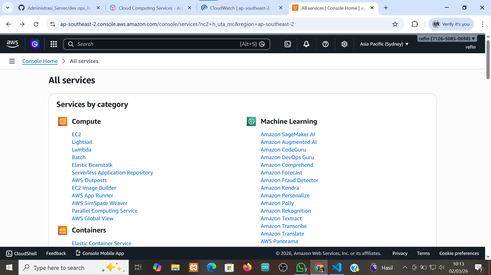
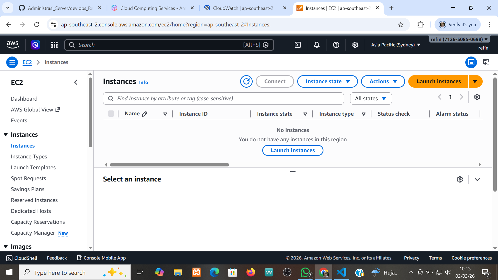
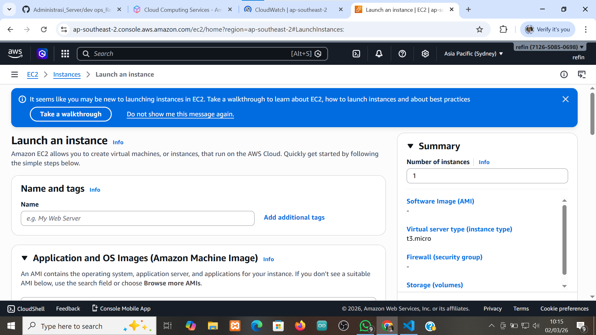
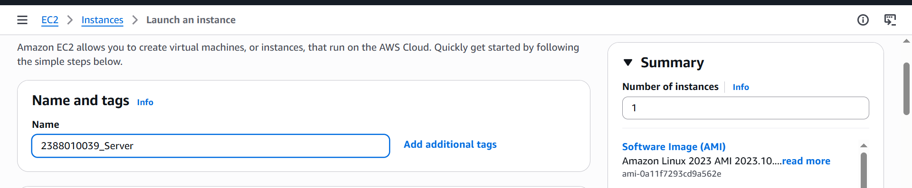
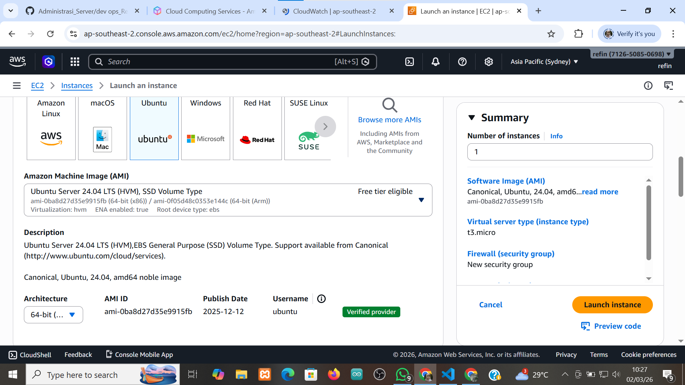
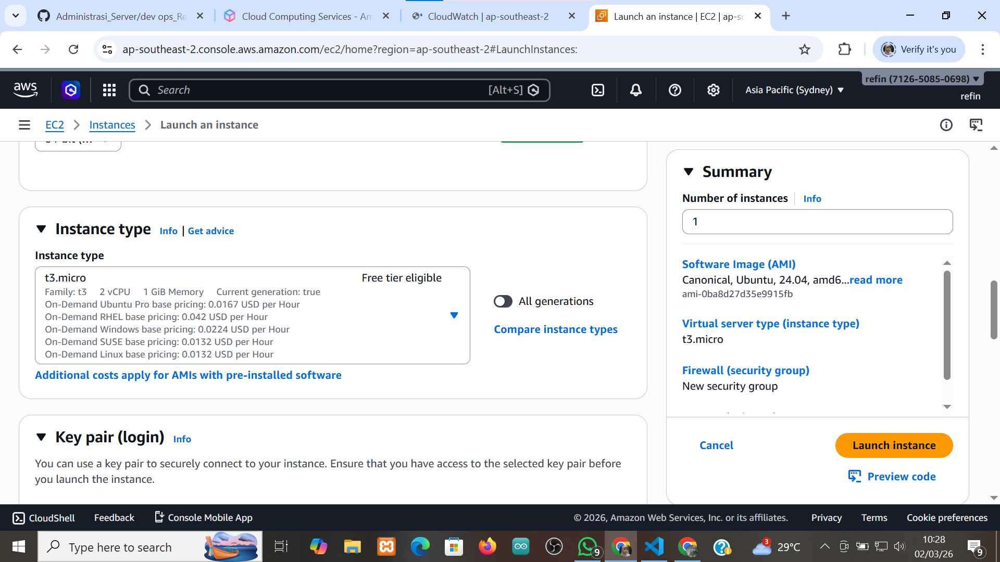
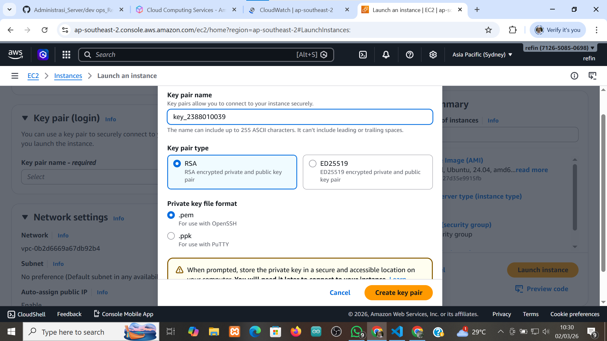
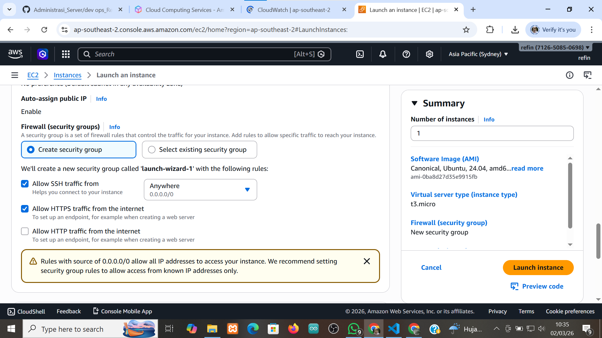
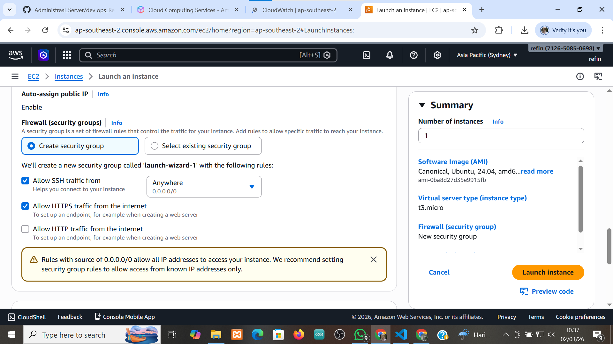
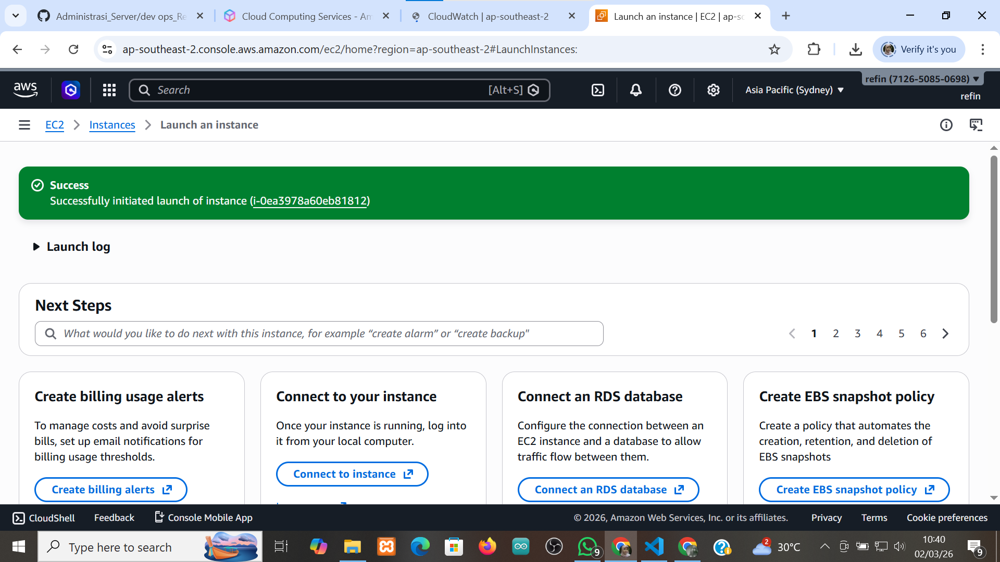

# membuat EC2

1. cari ec2 lalu klik

2. setelah masuk dalam menu ec2 klik intense

3. setelah intense pilih launch as intense

4. setelah klik launch bikin serverya pake nim_server

5. kita pilih os server untuk intamce

6. pilih resourch intance

7. membuat key pair pilih create new key pair, isi namanya, pilih rsa

8. setting kebijakan keamanan(security group) 
-Allow ssh
-Allow https
-Allow http

9. setelah selesai set-up pili launch intance

10. pastikan launch instance sukses

