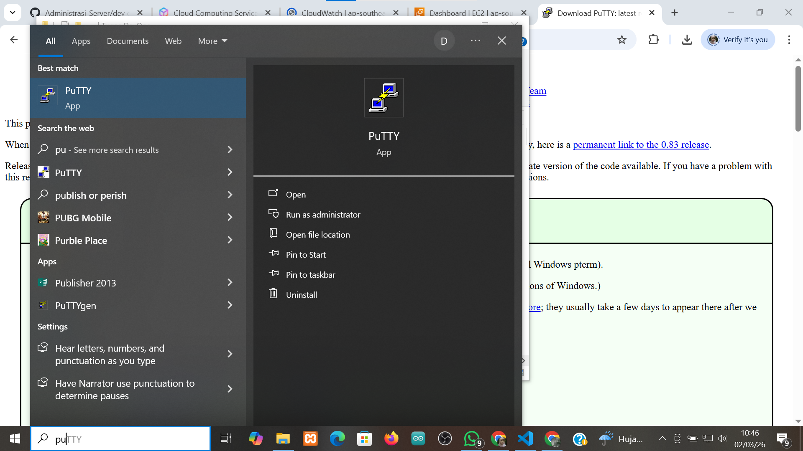
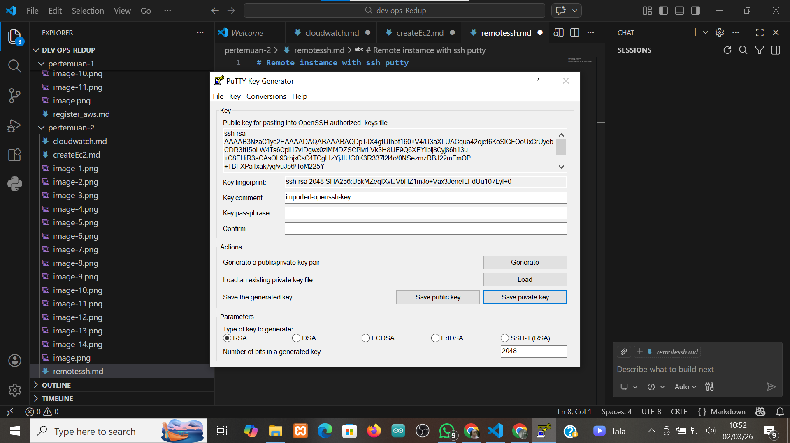
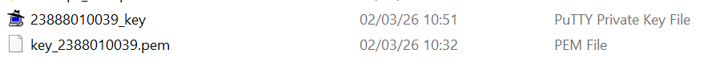
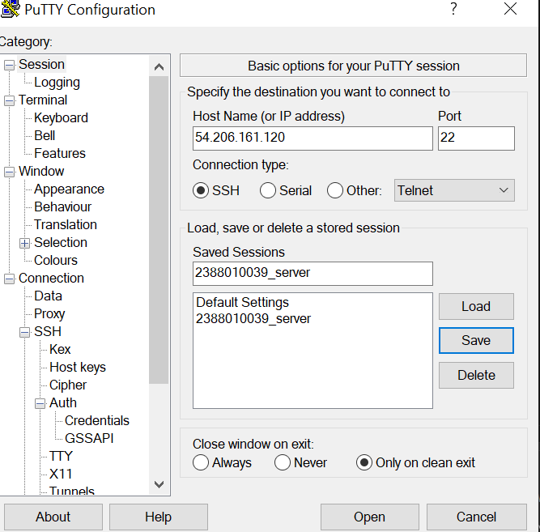
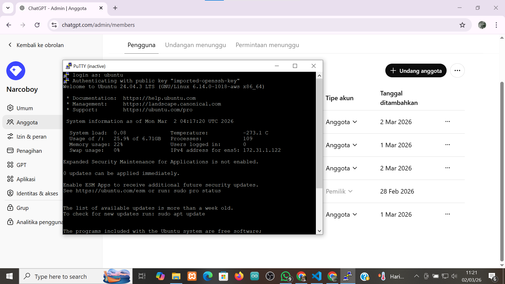
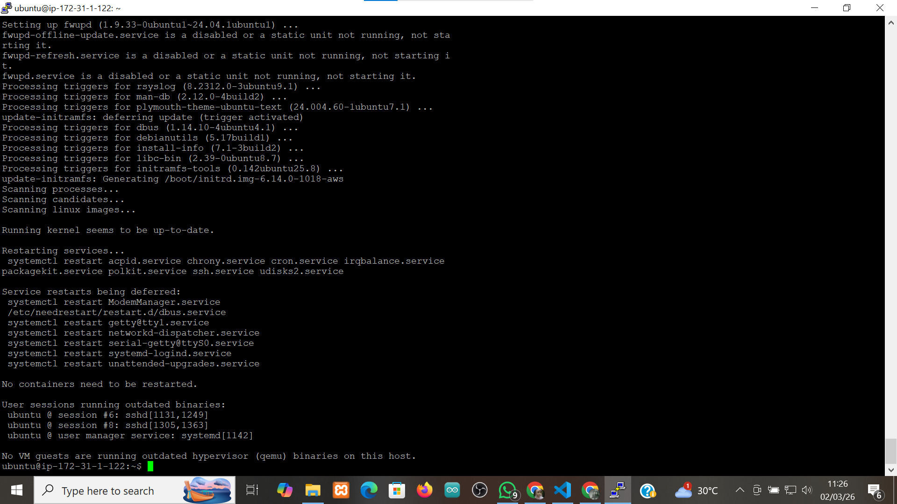
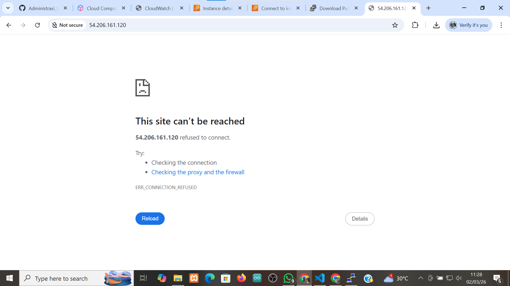
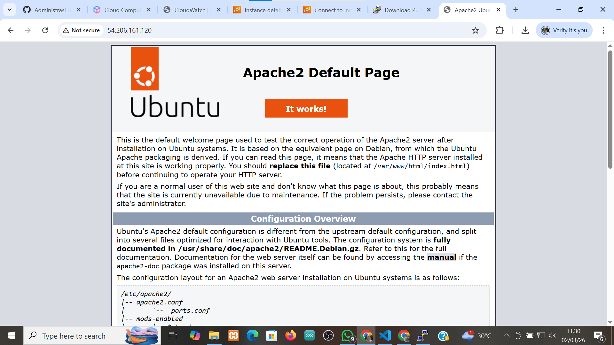
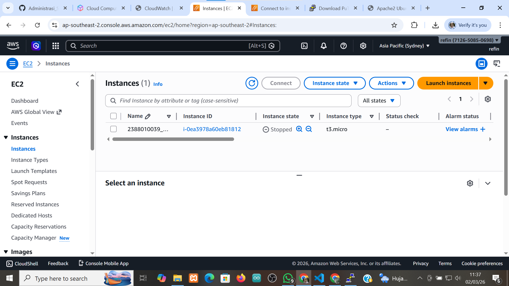

# Remote instamce with ssh putty

1. pastikan sudah install putty

2. konversi file public key dari .pem menjadi .ppk di putty
- buka puttyGen
- load file .pem
- save as .ppk

3. set up putty untuk remote ssh
- buka apps putty
- isi ip public sesuai 
- isi port untuk ssh sesuai security group di instance
- isi nama sessiom
- load file .ppk (klik ssh > auth > credentials > load file .ppk)
- 

4. sudo apt-get update terus sudo apt-get upgrade

6. pembuktian remote ssh secara visual
- copy public address instance paste ke browse

- install web server seperti apache
- sudo apt install apache2
- reload browser

7. matikan instance agar tidak kena tagihan
- sudo shutdown now
