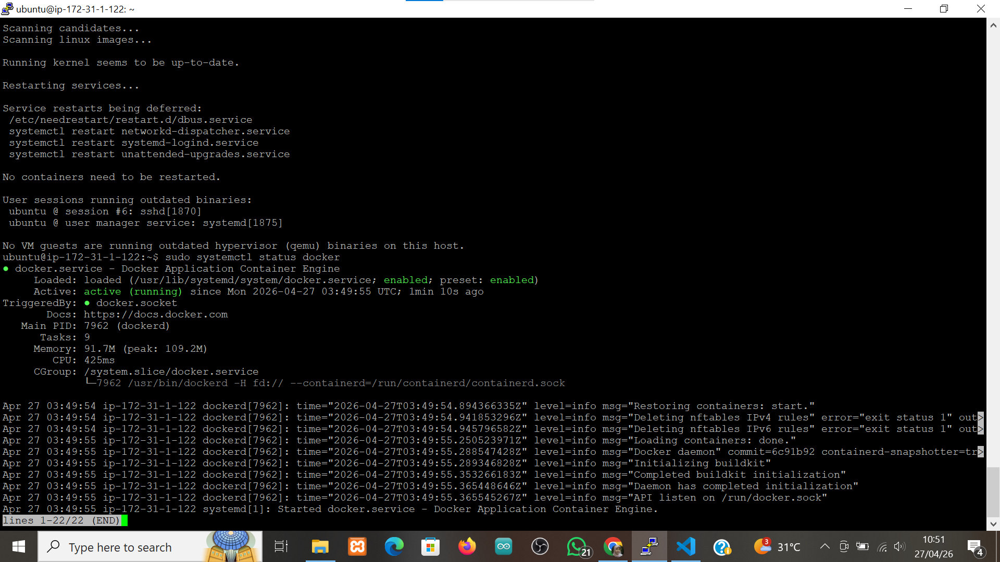
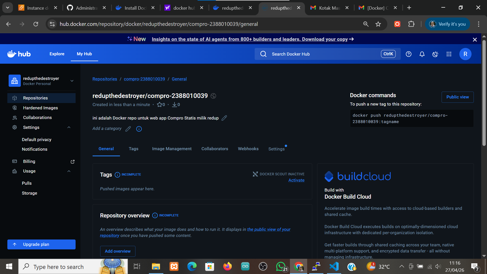
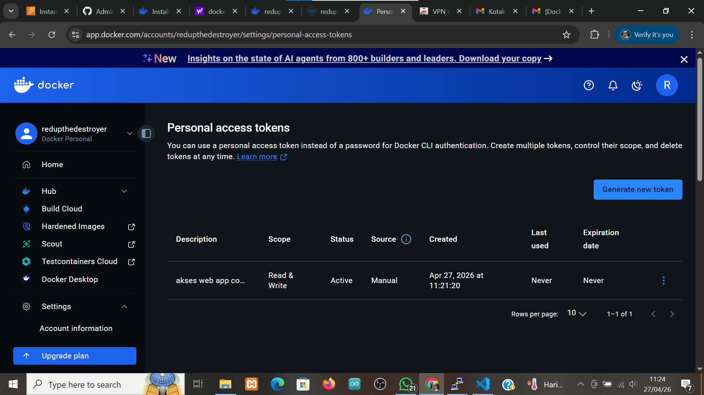
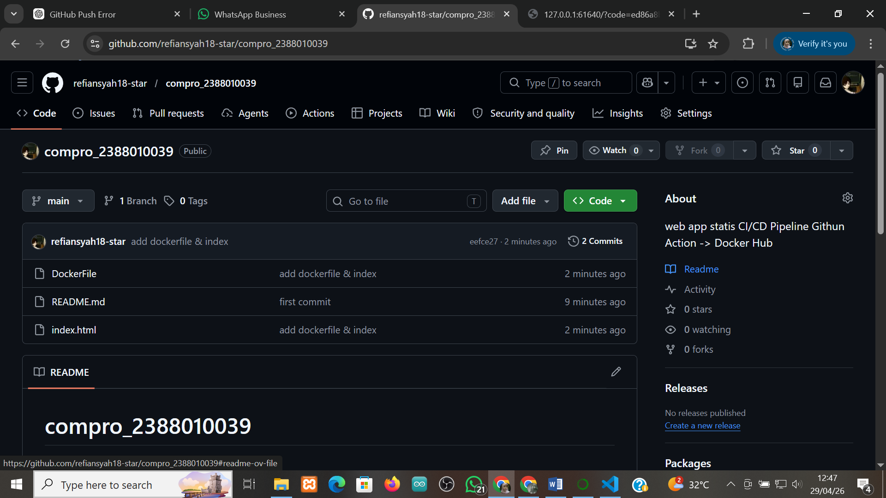

# intro docker engine

1. install docker ubuntu (https://docs.docker.com/engine/install/ubuntu/)

    2. add cert repository for docker 
    - uninstall old version docker 
    sudo apt remove $(dpkg --get-selections docker.io docker-compose docker-compose-v2 docker-doc podman-docker containerd runc | cut -f1)

    - install docker 
    sudo apt install ca-certificates curl
    sudo install -m 0755 -d /etc/apt/keyrings
    sudo curl -fsSL https://download.docker.com/linux/ubuntu/gpg -o /etc/apt/keyrings/docker.asc
    sudo chmod a+r /etc/apt/keyrings/docker.asc 

    3. add docker repository to apt -> sudo tee /etc/apt/sources.list.d/docker.sources <<EOF
    Types: deb
    URIs: https://download.docker.com/linux/ubuntu
    Suites: $(. /etc/os-release && echo "${UBUNTU_CODENAME:-$VERSION_CODENAME}")
    Components: stable
    Architectures: $(dpkg --print-architecture)
    Signed-By: /etc/apt/keyrings/docker.asc
    EOF

    4. update os -> sudo apt-get update 

    5. install docker engine -> ( sudo apt install docker-ce docker-ce-cli containerd.io docker-buildx-plugin docker-compose-plugin)

    6. cek installation -> sudo systemctl status docker
    

2. registrasi docker hub
    - URL docker hub -> https://app.docker.com/accounts/redupthedestroyer
    - 

3. create repository for docker 
    - klik home -> Hub -> Repository 
    - klik button new repository 
    - isi nama reponya 
    - visibility = public 
    - klik create 
    

4. Create token access
    - klik profile -> account setting -> personal access token
    - klik new token 
    - klik newe generate token 
    - isi deskripsi 
    - expire date = none
    - access permission = read/write
    - klik generate 
    

