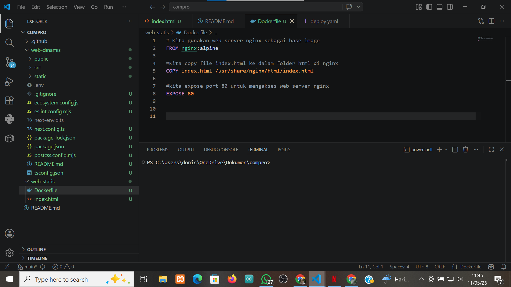
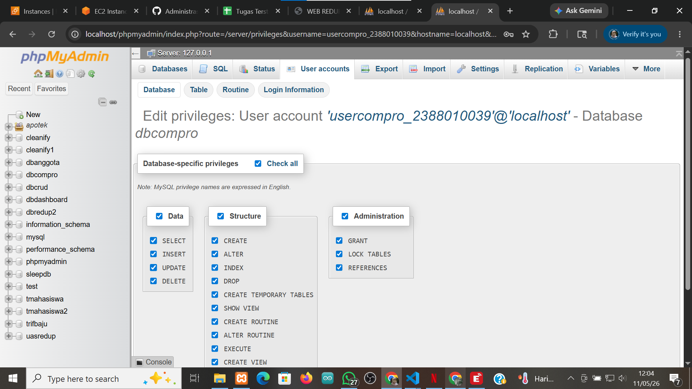
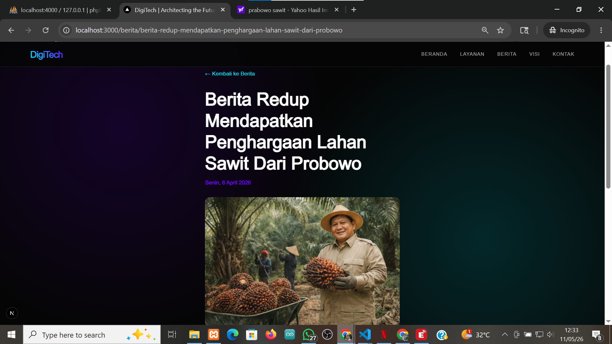

# Deploy Multu Appss CI/CD Docker 

1. start instance aws ec2
2. patching os -> sudo apt update && sudo apt upgrade 
3. hapus layanan nginx dan uninstall -> sudo systemctl stop nginx && sudo systemctl disable nginx
sudo apt remove apache2
4. hapus layanan mariadb dan uninstall -> sudo systemctl stop mariadb && sudo systemctl disable mariadb 
sudo apt auto-remove mariadb-server
sudo apt remove mariadb-server mariadb-client mariadb-common
5. testig Next.js + db menggunakan user bukan root pada local environtment 
- copy project dari ptmn6 kecuali folder .next, node_modules, dan sql. masukin ke dalam folder web dinamis 

- create user baru bukan root 

- sesuaikan isi file .env 
- open terminal -> cd web-dinamis
- npm i
- npm run dev
- edit berita ke-3 menjadi nama-nim

