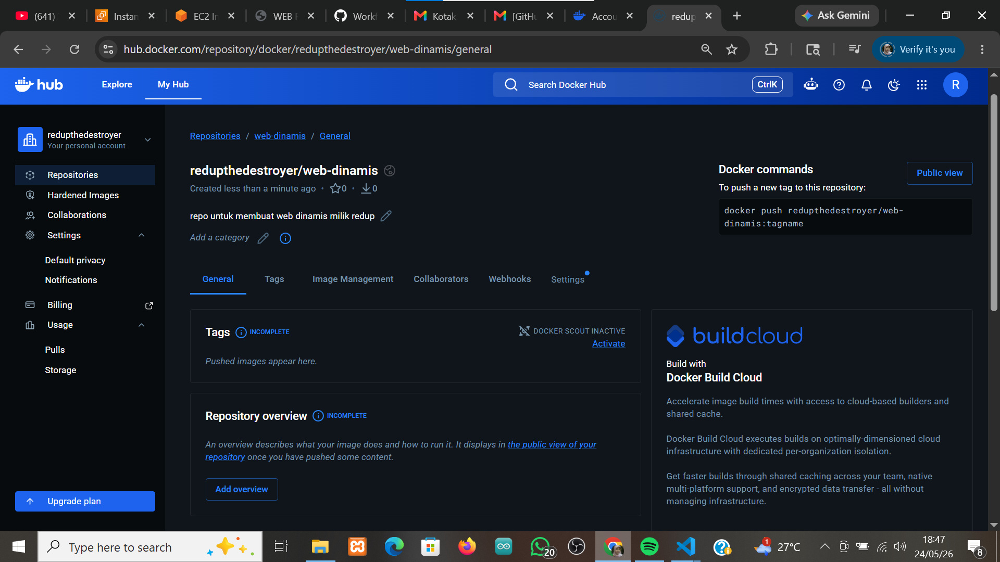
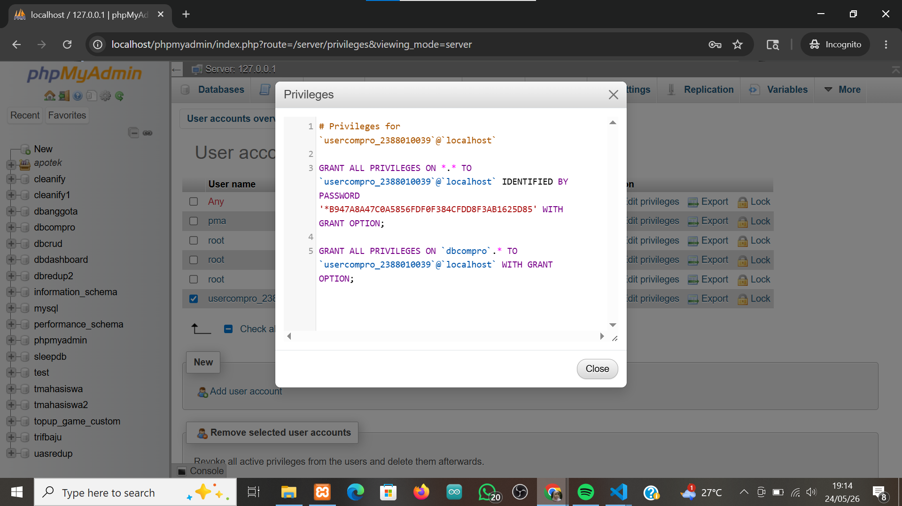
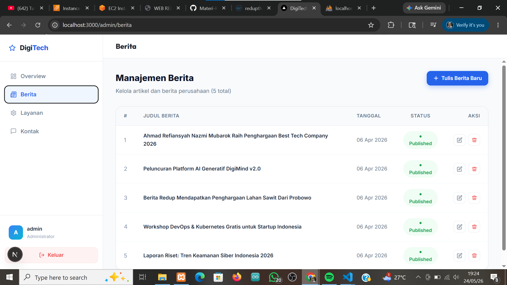
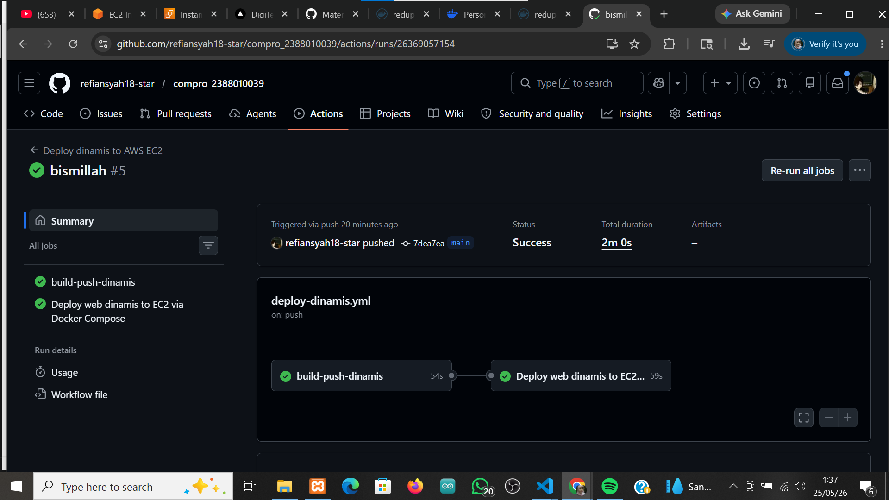
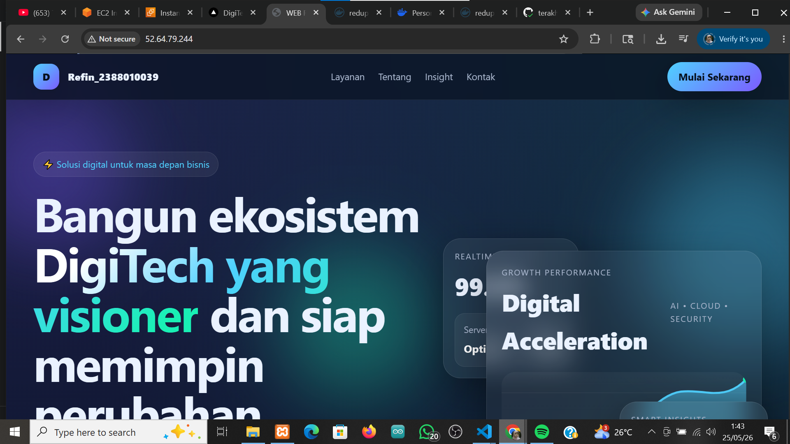
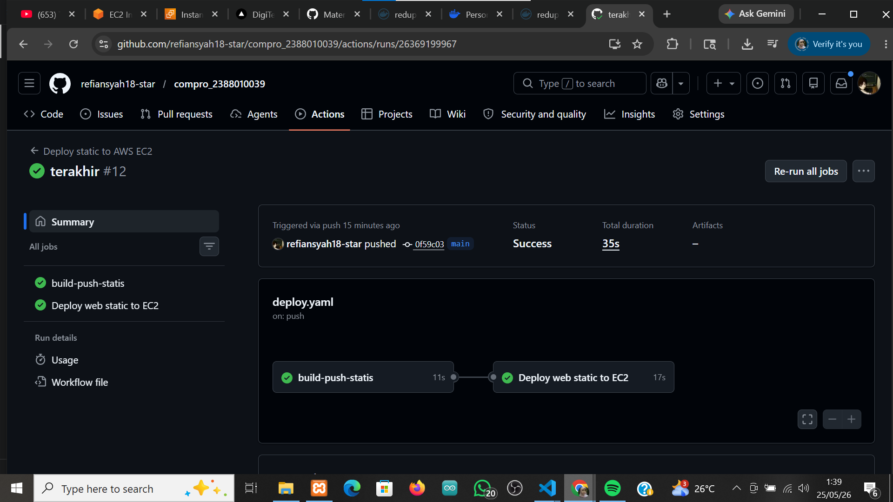
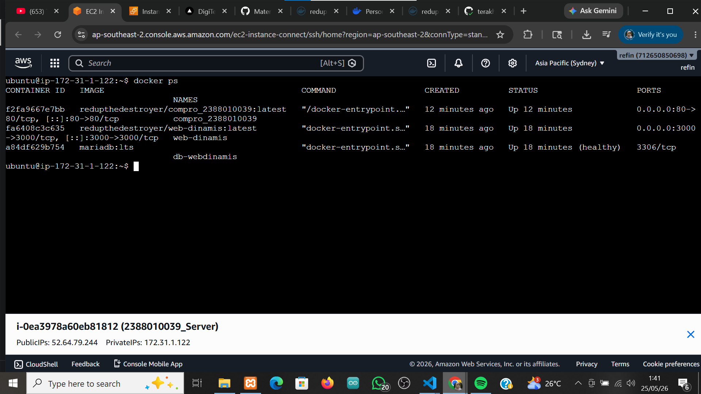
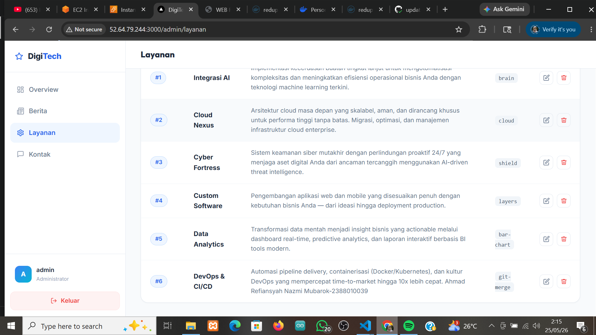

# Deploy multiple container menggunakan docker compos

1. start instance aws ec2
2. patching os -> sudo apt update && sudo apt upgrade 
3. hapus layanan nginx dan uninstall -> sudo systemctl stop nginx && sudo systemctl disable nginx
sudo apt remove apache2
4. hapus layanan mariadb dan uninstall -> sudo systemctl stop mariadb && sudo systemctl disable mariadb 
sudo apt auto-remove mariadb-server
sudo apt remove mariadb-server mariadb-client mariadb-common
5. Bikin repository baru di docker untuk web dinamis

7. Buka Projek Company himafor_nim
8. Bagi 2 Folder untuk projek Web App Statis dan Dinamis
9. Move file index dan Dcoker milik web statis ke Folder web-statis
10. Copy Folder Projek Next.JS (pertemuan9)ke folder web-dinamis
11. Lakukan Testing di Local Project Next.JS
    - Install Dependencies: npm install
    - Create user di DBMS : sudo mysql -u root -p
        - CREATE USER GRANT ALL PRIVILEGES ON *.* TO `usercompro_2388010039`@`localhost` IDENTIFIED BY PASSWORD '*B947A8A47C0A5856FDF0F384CFDD8F3AB1625D85' WITH GRANT OPTION;
          

    - Edit File .env di folder web-dinamis
    - npm run build
    - npm start
    - Pastikan web dapat diakses di http://localhost:3000 admin tanpa error

11. Buat file Dockerfile
12. Buat file docker-compose.yml
13. Buat Workflows File -> deploy-dinamis.yml di folder .github workflows/ dari Projek web-dinamis
14. Edit File -> deploy.yml di folder .github/workflows/ untuk
15. Update Host AWS di Github
16. Commit Changes ke GitHub dari lokal
17. Push Changes ke GitHub
18. Cek di Github, apakah actions jalan dan berhasi
    - web_dinamis

    
    
    
    
    - web_static
      
    

    
    
20. Cek di AWS, apakah container berjalan dengan baik

22. Akses web melalui Browser login admin edit Layanan

