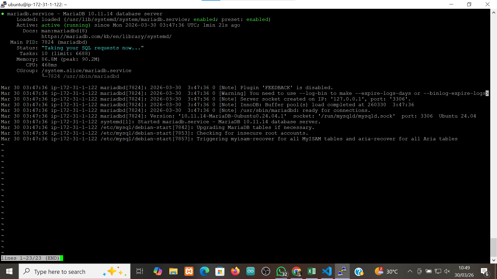
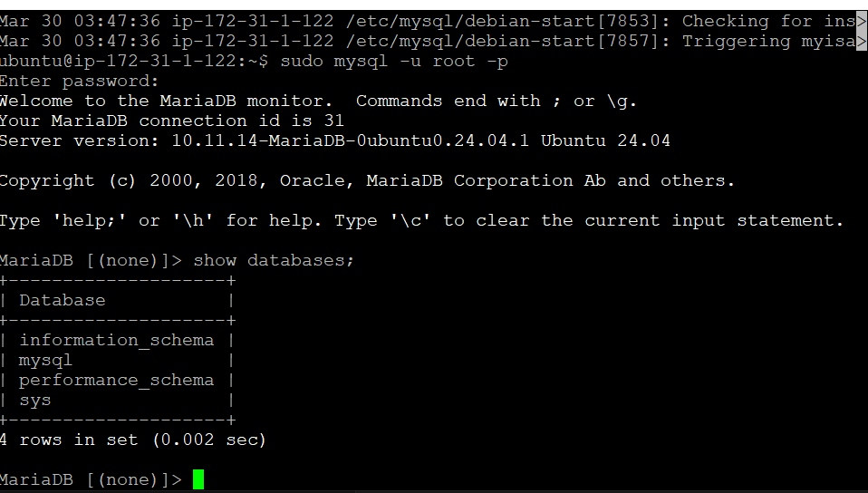
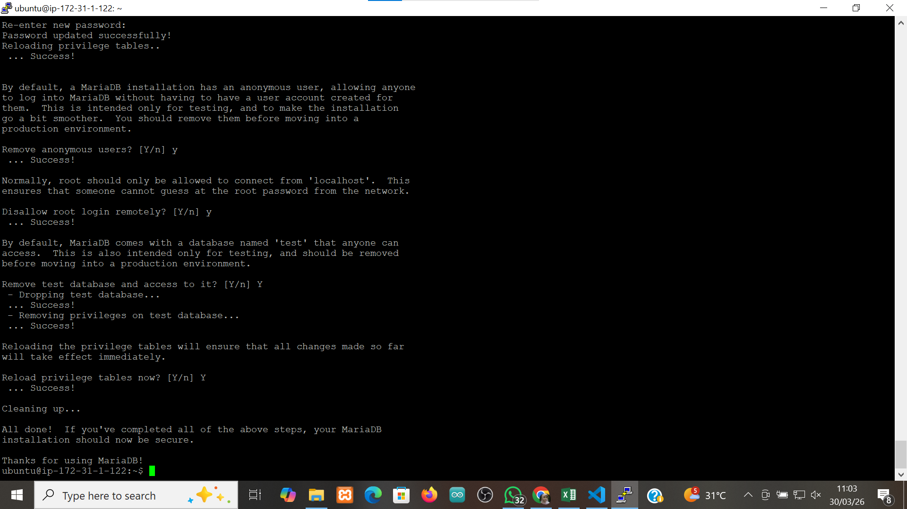
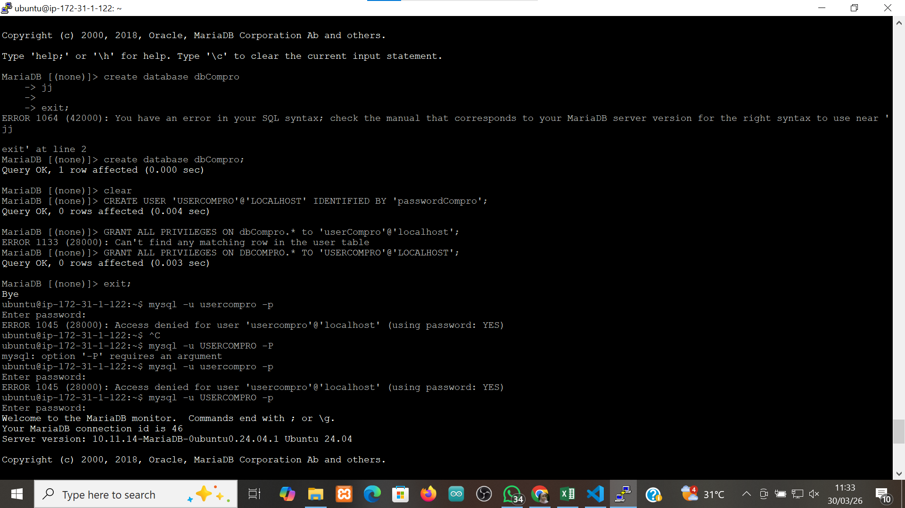
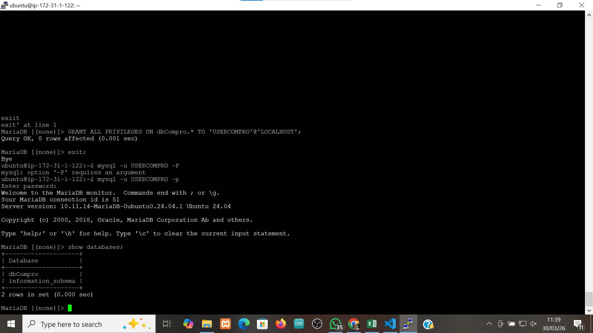

# Membuat Database MySql di aws EC2
1 Install MariaDB

sudo apt-get install mariadb-server
sudo system start mariadb
sudo system status mariadb

2. Kita lakukan Hardening Security

Masukan Command sudo mysql_secure_installation
Switch to unix_socket authentication : Y
Change the root password? : Y
Remove anonymous users? : Y
Disallow root login remotely? : Y
Remove test database and access to it? : Y
Reload privilege tables now? : Y

3. Membuat database dan User

membuat database untuk web company profile (create database dbCompro;)
membuat user untuk web company profile (create user 'userCompro'@'localhost' identified by '*********';)
Memberikan Hak akses user untuk web company profile (grant all privileges on dbCompro.* to userCompro'@'localhost';)
flush privileges

4. Login menggunakan akun database yang sudah di buat

login menggunakan username (sudo mysql -u userCompro -p)
enter password yang sudah di buat (passwordCompro)
lihat database yang sudah dibuat (show databases;)

