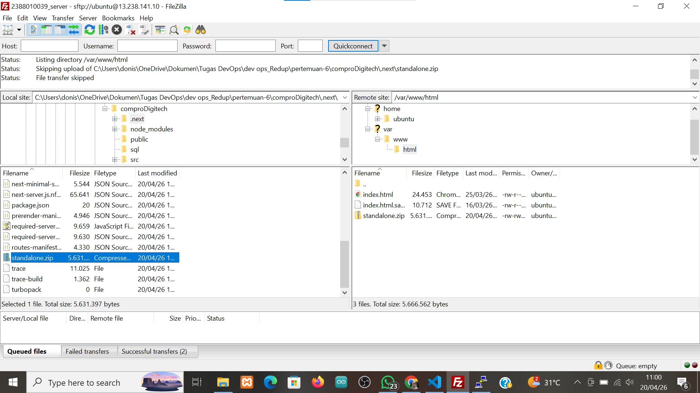
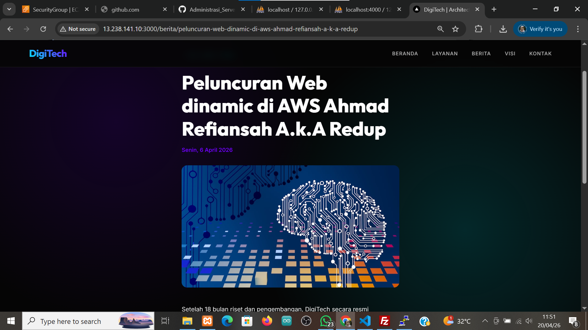

# Melakukan Uploading web apps dynamic di aws ec2

1. pastikan web apps dynamic berjalan tanpa error di localhost
2. jika sudah tanpa error kita akan membuat folder build
- npm run build
- pastikan menghasilkan folder .next/standalone di dalam tersedia folder public dan di folder .next ada folder static\
3. proses upload file folder standalone 
- lakukan proses archoive menjadi zip folder standalone
- upload file hasil archive --> connect open ssh -> conect filezila

- ekstract file hasil archive  di ec2 aws 
    1. install file unzip aws
        - sudo apt install unzip -y 
    2. Ekstract file hasil archive 
        - unzip standalone.zip 
4. 
5. 
# Ketinggalan s
